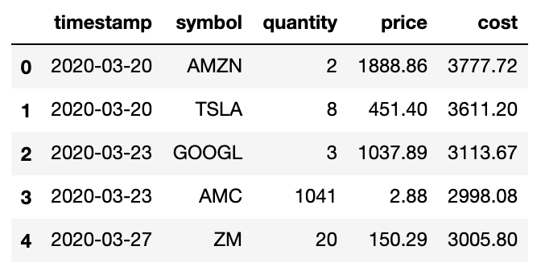
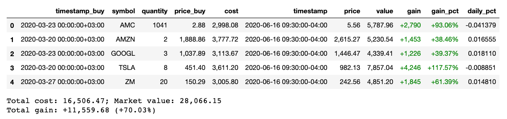
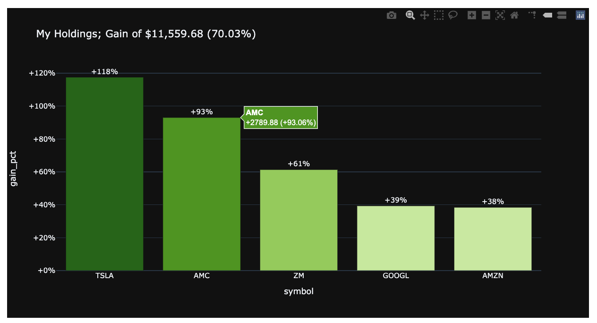
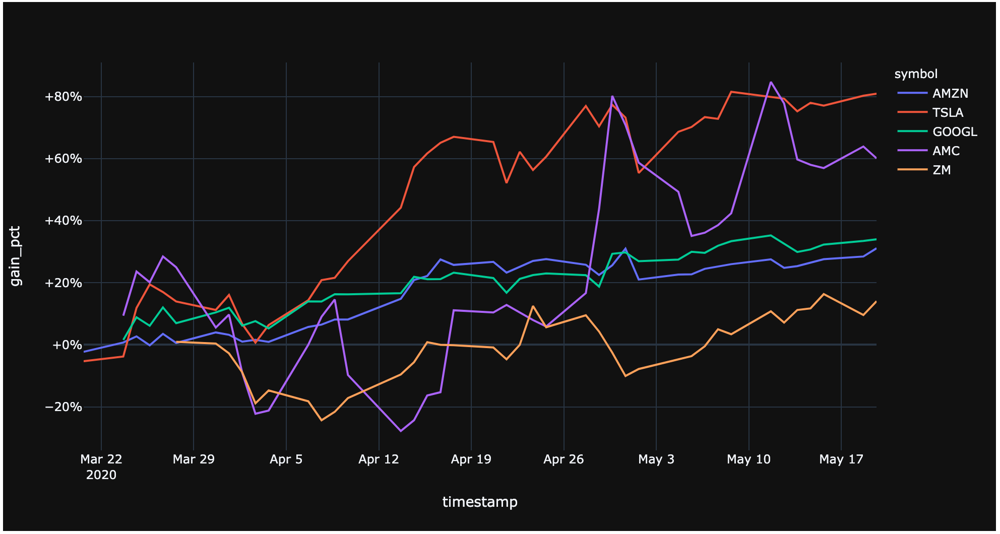

# capon
**Cap**ital Market in **P**yth**on**

|    Author    |                 Version                  |                   Demo                   |
| :----------: | :--------------------------------------: | :--------------------------------------: |
| Gialdetti | [](https://mybinder.org/v2/gh/gialdetti/capon/master?filepath=examples%2Fmonitoring%2Fmy_portfolio_performance.ipynb) |  |


`capon` is a python package for easily obtain and analyze real-time stock data. Provides stock metadata and features.
In addition, it offers simple APIs to track your personal stock portfolios and its updated status.


## Installing
Install and update using [pip](https://pip.pypa.io/en/stable/quickstart/):
```bash
$ pip install capon
```

## A simple example
Track your personal stock portfolio with real-time data.

a) Define my holdings
```python
from capon import Portfolio, Lot
my_portfolio = Portfolio([
    Lot('2020-03-20', 'AMZN',   2, 1888.86),
    Lot('2020-03-20', 'TSLA',   8,  451.40),
    Lot('2020-03-23', 'GOOGL',  3, 1037.89),
    Lot('2020-03-23', 'AMC', 1041,    2.88),
    Lot('2020-03-27', 'ZM',    20,  150.29),
])
```



b) Sync with real-time stock data to find current status.
```python
latest = my_portfolio.status()
display(latest)

total_cost, total_value = latest.sum()[['cost', 'value']]
print(f'Total cost: {total_cost:,.2f}; Market value: {total_value:,.2f}')
print(f'Total gain: {total_value-total_cost:+,.2f} ({total_value/total_cost-1:+,.2%})')
```


c) Plot it
```python
import plotly.express as px

px.bar(latest.sort_values('gain_pct', ascending=False), 
       x='symbol', y='gain_pct', color='gain_pct', 
       text='gain_pct', hover_data=['gain'],
       color_continuous_scale=px.colors.diverging.PiYG, color_continuous_midpoint=0,
       title='My Holdings')
```


d). Plot historical data
```
performance = my_portfolio.performance()
px.line(performance, x='timestamp', y='gain_pct', color='symbol')
```


## Testing
After installation, you can launch the test suite:
```bash
$ pytest
```

## Help and Support

### Examples

|     Theme    |   MyBinder   | Colab |
| ------------ | :----------: | :---: |
| My Stock Portfolio Performance | [](https://mybinder.org/v2/gh/gialdetti/capon/master?filepath=examples%2Fmonitoring%2Fmy_portfolio_performance.ipynb) | |    
