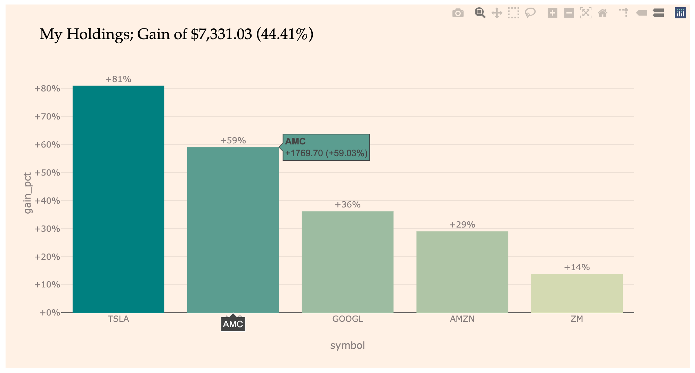

# capon
**Cap**ital Market in **P**yth**on**

|    Author    |                 Version                  |                   Demo                   |
| :----------: | :--------------------------------------: | :--------------------------------------: |
| Gialdetti | [](https://pypi.org/project/capon/) | [](https://mybinder.org/v2/gh/gialdetti/capon/master?filepath=examples%2Fmonitoring%2Fmy_portfolio_performance.ipynb) |  |


`capon` is a python package for easily obtaining and analyzing real-time stock data. It provides extended datasets of stock metadata and features.
In addition, it offers simple APIs for tracking your personal stock portfolios and their live status.

## Installation
### Install latest release version via [pip](https://pip.pypa.io/en/stable/quickstart/)
```bash
$ pip install capon
```

### Install latest development version
```bash
$ pip install git+https://github.com/gialdetti/capon.git
``` 
or
```bash
$ git clone https://github.com/gialdetti/capon.git
$ cd capon
$ python setup.py install
```

## A simple example
Get the historical stock price of AMD, and plot it.
```python
import capon

amd = capon.stock('AMD', range='ytd')
```


The historical data is given as a standard [pandas](https://pandas.pydata.org/) dataframe. 
This allows a fast and powerful data analysis, manipulation and visualization. For instance,
```python
amd.plot(x='timestamp', y='adjclose')
```


## My portfolio example
Track your personal stock portfolio with real-time data.

a) Define my holdings
```python
from capon import Portfolio, Lot

my_portfolio = Portfolio([
    Lot('2020-03-20', 'AMZN',   2, 1888.86),
    Lot('2020-03-20', 'TSLA',   8,  451.40),
    Lot('2020-03-23', 'GOOGL',  3, 1037.89),
    Lot('2020-03-23', 'AMC', 1041,    2.88),
    Lot('2020-03-27', 'ZM',    20,  150.29),
])
```


b) Sync with real-time stock data to find current status
```python
status = my_portfolio.status()
display(status)

total_cost, total_value = status.sum()[['cost', 'value']]
print(f'Total cost: {total_cost:,.2f}; Market value: {total_value:,.2f}')
print(f'Total gain: {total_value-total_cost:+,.2f} ({total_value/total_cost-1:+,.2%})')
```


c) Plot it
```python
from capon.visualization import plot_status
plot_status(status)
```


d) Plot historical data
```python
import plotly.express as px

performance = my_portfolio.performance()
px.line(performance, x='timestamp', y='gain_pct', color='symbol', template='capon')
```


The full example in a live notebook is provided [below](#examples).

## Help and Support

### Examples

The tutorials below aim to provide a clear and concise demonstration of some of the most important capabilities of `capon`.
For instance, step-by-step guides for building and real-time monitoring of your portfolio, for fetching and analyzing 
stock historical data, or for using stocks metadata.

To make it a bit more interesting (hopefully), each tutorial first poses a meaningful stock-market "research question".
In the context of answering these questions, the tutorials demonstrate the relevant library features.  

|     Theme    |   MyBinder   | Colab |
| ------------ | :----------: | :---: |
| [My Stock Portfolio Performance](https://nbviewer.jupyter.org/github/gialdetti/capon/blob/master/examples/monitoring/my_portfolio_performance.ipynb) | [](https://mybinder.org/v2/gh/gialdetti/capon/master?filepath=examples/monitoring/my_portfolio_performance.ipynb) | [](https://colab.research.google.com/github/gialdetti/capon/blob/master/examples/monitoring/my_portfolio_performance.ipynb) |    
| [Stock Market Crash and Rebound Amid Coronavirus](https://nbviewer.jupyter.org/github/gialdetti/capon/blob/master/examples/market_analysis/stock_indexes.ipynb) | [](https://mybinder.org/v2/gh/gialdetti/capon/master?filepath=examples/market_analysis/stock_indexes.ipynb) | [](https://colab.research.google.com/github/gialdetti/capon/blob/master/examples/market_analysis/stock_indexes.ipynb) |
| [Analyzing the Sector-level Crash and Rebound](https://nbviewer.jupyter.org/github/gialdetti/capon/blob/master/examples/market_analysis/sector_crash_and_rebound.ipynb) | [](https://mybinder.org/v2/gh/gialdetti/capon/master?filepath=examples/market_analysis/sector_crash_and_rebound.ipynb) | [](https://colab.research.google.com/github/gialdetti/capon/blob/master/examples/market_analysis/sector_crash_and_rebound.ipynb) |


## Testing
After cloning and installing the development version, you can launch the test suite:
```bash
$ pytest
```

